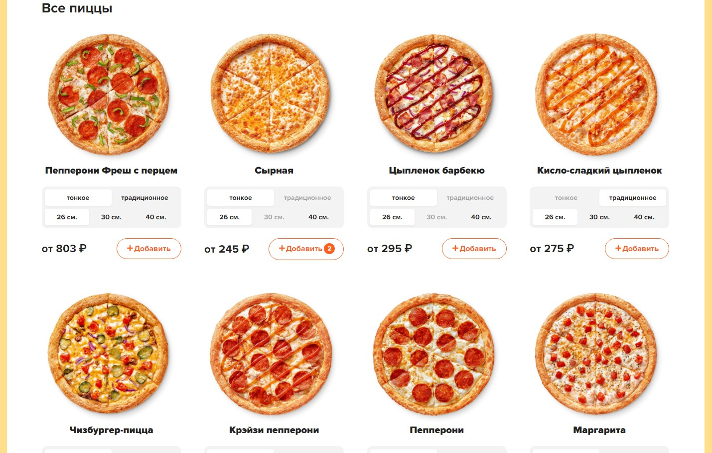

# Проект React Pizza

<kbd>  </kbd>

### Описание:
Небольшой интернет-магазин на React.

### Стек технологий:

| JavaScript <code></code> | React <code></code> | Redux <code></code>|
|---|---|---|

> Также в проекте используется [json-server](https://github.com/typicode/json-server "ссылка на JSON Server") для имитации подгрузки данных с сервера

### Функциональность:
* Добавление/удаление товара в корзину
* Пересчет суммы товаров в корзине
* Сортировка по типу товара
* Сортировка по выбранному критерию
* Очистка корзины

### Инструкция по установке:
1. Установите [Node.js](https://nodejs.org/en/ "ссылка на сайт Node.js")
2. Установите [Git](https://git-scm.com/ "ссылка на сайт Git")
3. Скачайте архив данного репозитория или склонируйте себе при помощи команды:
```sh
git clone https://github.com/koshmar1319/react-pizza.git
```
4. Установите все зависимости:
```sh
npm install
```
5. Запустить проект в режиме разработчика:
```sh
npm run start
```
6. Запустить проект в режиме production:
```sh
npm run build
```
7. Запустить JSON server:
```sh
npm run server
```

### Демо:
> Heroku <br/>[Ссылка на сайт :arrow_lower_right:](https://react-pizza-kshmr.herokuapp.com/ "ссылка на сайт")
